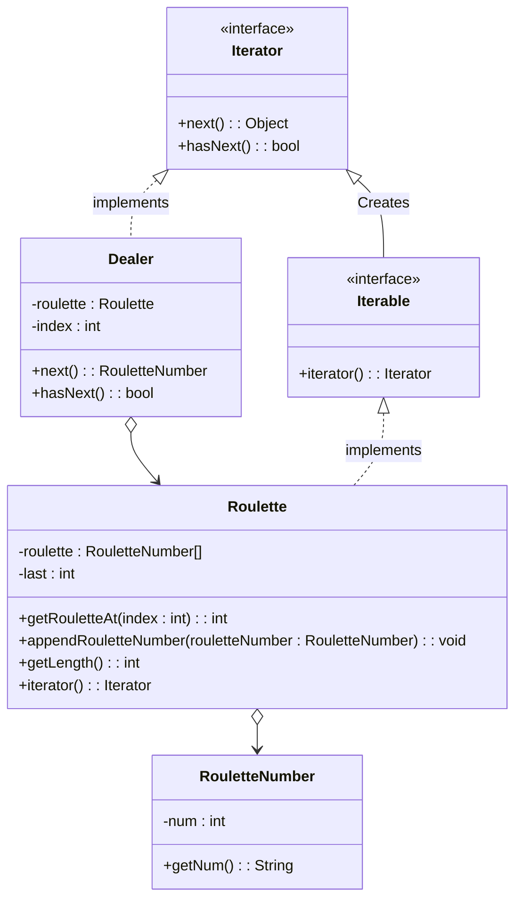

### クラス図

```mermaid
classDiagram
    class Iterable {
        <<interface>>
        +iterator() : Iterator
    }

    class Roulette {
        -roulette : RouletteNumber[]
        -last : int
        +getRouletteAt(index : int) : int
        +appendRouletteNumber(rouletteNumber : RouletteNumber) : void
        +getLength() : int
        +iterator() : Iterator
    }
    
    class Iterator {
        <<interface>>
        +next() : Object
        +hasNext() : bool
    }
    
    class Dealer {
        -roulette : Roulette
        -index : int
        +next() : RouletteNumber
        +hasNext() : bool
    }
    
    class RouletteNumber{
      -num : int
      +getNum() : String
    }
    
    Iterator <|.. Dealer: implements
    Roulette o--> RouletteNumber
    Dealer o--> Roulette 
    Iterator  <|--  Iterable: Creates
    Iterable <|.. Roulette: implements
```
